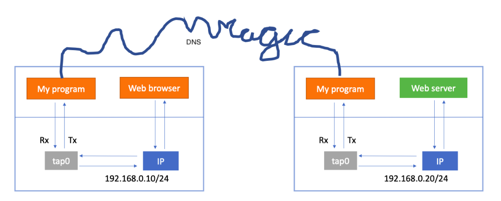

# IP-over-DNS tunneling (Client part)

## Overview

IP-over-DNS tunneling, also known as DNS tunneling, is a method that 
circumvents typical network protections by encapsulating regular requests and 
responses (such as HTTP requests) into the standard DNS format, which is often 
subject to less scrutiny. 
One advantage of this approach is evident when attempting to connect to a 
charged Wi-Fi hotspot that may not have robust security measures in place. 
Since DNS requests undergo less inspection, the transmitted data is less likely 
to be blocked.

The project can be divided into two main components: the client and the server. 
The client is responsible for establishing the Internet connection and includes 
a program that converts requests into the DNS format and decodes DNS responses. 
On the other hand, the server acts as an intermediary, receiving the DNS 
requests, unpacking them, and forwarding them to the actual server that the 
client wishes to communicate with. The process is reversed for the responses.

A crucial step in gaining full control over the data traffic is the creation of 
a virtual interface called "tap" on the local machine. 
Additionally, the routing table is modified to ensure that all traffic is 
routed through this interface. The `DNS_Client` program reads data from the tap 
interface and encapsulates it into the DNS format. 
The `DNS_Packet` structure encompasses all the attributes corresponding to 
the standard protocol, and their values are assigned based on the information 
retrieved from the tap interface. Finally, we implemented the `DNS_to_Bytes`
function in the `DNS_Encode.h` file, which converts DNS packets into byte arrays.

The following diagram provides an overview of IP-over-DNS tunneling:


## Quick explanation on data wrapping

According to the [RFC 1035](https://www.rfc-editor.org/rfc/rfc1035) Section 4, 
DNS datagrams follow a specific format:
```text
    +---------------------+
    |        Header       |
    +---------------------+
    |       Question      | the question for the name server
    +---------------------+
    |        Answer       | RRs answering the question         (left empty)
    +---------------------+
    |      Authority      | RRs pointing toward an authority   (left empty)
    +---------------------+
    |      Additional     | RRs holding additional information (left empty)
    +---------------------+
```

The `Header` section is always present and contains the following fields:
```text
                                    1  1  1  1  1  1
      0  1  2  3  4  5  6  7  8  9  0  1  2  3  4  5  (bit)
    +--+--+--+--+--+--+--+--+--+--+--+--+--+--+--+--+
    |                      ID                       |
    +--+--+--+--+--+--+--+--+--+--+--+--+--+--+--+--+
    |QR|   Opcode  |AA|TC|RD|RA|   Z    |   RCODE   |
    +--+--+--+--+--+--+--+--+--+--+--+--+--+--+--+--+
    |                    QDCOUNT (1)                |
    +--+--+--+--+--+--+--+--+--+--+--+--+--+--+--+--+
    |                    ANCOUNT (0)                |
    +--+--+--+--+--+--+--+--+--+--+--+--+--+--+--+--+
    |                    NSCOUNT (0)                |
    +--+--+--+--+--+--+--+--+--+--+--+--+--+--+--+--+
    |                    ARCOUNT (0)                |
    +--+--+--+--+--+--+--+--+--+--+--+--+--+--+--+--+
```
The `Question` section typically contains the domain name of the server being 
queried, stored in the `QNAME` field:
```
                                    1  1  1  1  1  1
      0  1  2  3  4  5  6  7  8  9  0  1  2  3  4  5  (bit)
    +--+--+--+--+--+--+--+--+--+--+--+--+--+--+--+--+
    |                                               |
    /                     QNAME                     /
    /                                               /
    +--+--+--+--+--+--+--+--+--+--+--+--+--+--+--+--+
    |                     QTYPE                     |
    +--+--+--+--+--+--+--+--+--+--+--+--+--+--+--+--+
    |                     QCLASS                    |
    +--+--+--+--+--+--+--+--+--+--+--+--+--+--+--+--+
```
In IP-over-DNS tunneling, typical requests and responses can be wrapped within 
the `QNAME` field, which allows to store the most information compared to other
fields, subject to certain size limits 
(refer to [RFC 1035](https://www.rfc-editor.org/rfc/rfc1035) Section 2.3.4).

The `QNAME` field consists of a sequence of labels where each label follows a 
specific format: a length byte followed by the corresponding number of bytes.
For example, a label like `www` would be represented as `3www`. 
The length of a label should not exceed 63 bytes (the first two bits of the 
length byte are reserved), and the overall size of the `QNAME` field itself 
should be 255 bytes or less, including a final null byte (0) after the labels.

To encapsulate the standard requests and responses into DNS packets, we 
divide them into manageable chunks.  
Considering the length bytes and the final null byte, each DNS packet can 
contain up to 250 bytes of information to be stored within the `QNAME` field.
Finally, the entire DNS packet, sent as a UDP message, should not exceed 
512 bytes. 
As a result, each DNS packet would only contain one single `Question` section,
i.e., `qdcount = 1`.

## Usage 1

To test and visualize the encoding of a random byte array into DNS packets, 
which are subsequently transformed into byte arrays for transmission, you can 
easily follow these steps:

1. Compile the code by executing the following command: `$ make clean; make`.

2. Launch the testing script by running: `$ build/test`.

In this example, the message to be wrapped consists of a 512-byte array 
containing `1 + i % 255` in each byte indexed `i` 
(followed by a null byte at the end).

## Usage 2

To test and visualize the real transmission of standard requests wrapped into
the DNS format, please follow the steps below:

1. Install **openvpn** by running the following command, for example: 
`$ sudo apt-get install openvpn`.

2. Launch the setup script by executing: `$ sudo ./setup_tap.sh`. 
This will ensure that all traffic directed towards `8.8.8.8` will pass through 
the virtual interface `tap0`.

3. Open the `Makefile` and modify the script name from `test` to `client`.

4. Compile the code by entering: `$ make clean; make`.

5. Launch the DNS Client by running: 
`$ build/client www.google.com 127.0.0.1`.
The first argument, `www.google.com`, specifies the target server for 
communication. 
The second argument, `127.0.0.1`, would typically be the IP address of the DNS 
server. 
However, in this test, we are using the local machine itself.

6. Take note of any noise displayed on the terminal, which is read from `tap0` 
for an unknown reason. 
However, if you attempt to **ping 8.8.8.8** in another terminal, you will 
observe corresponding messages passing through. 
These are the data that will be wrapped into DNS format and sent to the server.

7. To terminate the `tap0` interface, execute: `$ sudo ./shut_tap.sh`.

## Remarks

In fact, there are still some challenges in this project that we were unable to 
overcome, particularly regarding listening to the response:
the DNS protocol utilizes the UDP protocol, which does not involve formal 
"handshakes." 
Consequently, the client must continuously send "empty" messages to inquire 
whether there are any responses from the server(s), as the intermediate server 
does not spontaneously inform the client, even if, for instance, the target 
server has already responded to the intermediate server. 

Given the complexities involved in implementing the server component, 
we made the decision to conclude the project in a simplified manner. 
Despite these challenges, the communication between the client and server, as 
well as the encoding/decoding process, have been successfully accomplished.